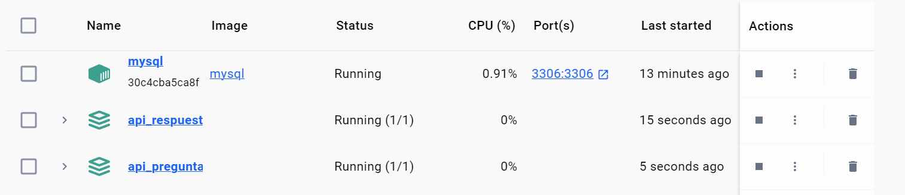
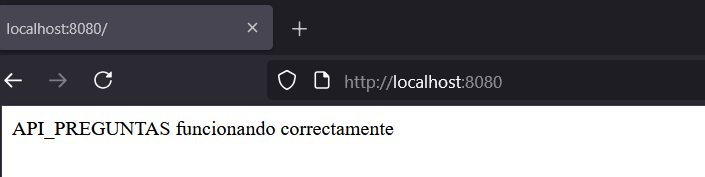

# GRUPO9-2025-1-PROYINF


Este es el repositorio del grupo 9, cuyos integrantes son:

* Benjamin Abde  - 202130021-k
* Joaquín Belmar - 202330003-9
* Nicolas Jego   - 202273013-7
* Alberto Oñate  - 202173103-2
* **Tutor**: Paula Castillo

## [Wiki](https://gitlab.com/benjax79/grupo9-2025-proyinf/-/wikis/home)

# GRUPO5-2025-2-PROYINF


Este es el repositorio del grupo 5, cuyos integrantes son:

* Alberto Oñate  - 202173103-2
* Sebastian Castillo - 202273583-k
* Daniel Sáez - 202273613-5
* Vicente Carvajal -
* **Tutor**: Sebastian Salgado

## Presentación cliente

[Video](https://youtu.be/s9JVPyjQAQs) de la **presentación del cliente**.

## Presentación prototipo

[Video](https://youtu.be/H5h_zy9Y0XM) de la presentación del **prototipo inicial**.


## Vista Directivo Funcional

[Video](https://youtu.be/40oafag3Wac) de la vista del Directo Funcional**.

# Video Resultado Final del Sistema Implementado

[Video](https://youtu.be/Csjc_EWqyhc) del resultado Final del Sistema Implementado**.

## Prototipos no funcionales

La estructura de las páginas está fuertemente basada en los prototipos no funcionales, realizadas en la plataforma Canva, a los que se puede acceder con los siguientes links:

- [Prototipo no Funcional Vista de Docente](https://www.canva.com/design/DAGnMr12k2E/NpUe5zITuHcJT17LZZA17Q/edit)

- [Prototipo no Funcional Vista de Estudiante](https://www.canva.com/design/DAGp0gH9JMk/jYRXS4-NTp42M0PJvgdR7g/edit?ui=eyJEIjp7IlAiOnsiQiI6ZmFsc2V9fX0)

## Aspectos técnicos relevantes  

Si antes momento de montar el proyecto base, el usuario ha usado xampp anteriormente (o cualquier montura para sql/otros que use los puertos 3306), se debe parar ese servicio para montar las bases de datos usados en este proyecto.

## Requerimientos

Para utilizar el proyecto base debe tener instalado [Node.js](https://nodejs.org/en), [Docker](https://www.docker.com/), se recomienda usar Visual Studio Code para modificar cualquier archivo o para acceder a la consola, y se recomienda [Postman](https://www.postman.com/) para poder probar los endpoints de las APIs. Al ya tener instalado Docker, se recomienda reinciar el PC para un correcto funcionamiento.


* CADA VEZ QUE SE HAGA UNA ACTUALIZACIÓN, ES RECOMENDABLE BORRAR E INSTALAR, YA SEA LAS BD O LOS CONTENEDORES DE DOCKER CON LAS INSTRUCCIONES DE A CONTINUACIÓN.


## Levantando el proyecto
Iniciaremos levantando la imagen de mysql en docker.

1. Abra Docker Desktop.
2. Abra Visual Studio Code como administrador.
3. Abra en Visual Studio Code la carpeta **proyecto-base-main** de este repositorio.
4. Abra una terminal de bash directamente desde Visual Studio Code.
5. Ingrese en esa terminal, el siguiente código:
```
docker-compose up --build
```
6. Luego de pasado unos segundos, abra Docker y verifique si el contenedor se ha cargado completamente.

Una vez ya realizado la configuración de sql en nuestro sistema, ya podemos crear las bases de datos.

En caso de querer borrar el contenedor para reinstalar, se puede borrar directamente por Docker Compose, o directamente en la terminal con el siguiente comando:

```
docker-compose down
```

### Configuración del Proyecto
#### Bases de Datos
Para comenzar, deben tener ejecutándose el contenedor de la base de datos sql.

Ahora, crearemos las bases de datos. Para esto debemos entrar en el contenedor, con el siguiente comando (Si el terminal de Visual Code Studio sigue funcionando, se puede crear otra terminal, o bien, ir a la consola de docker):
```
docker exec -it proyecto-base-main-mysql-1 mysql -uroot -p
```
En caso de haber problemas con el nombre de la base de datos, escribir en la terminal "docker ps" para verificiar el nombre del contenedor. Luego, deben ingresar la clave que en este caso es: **password**.

Una vez dentro del contenedor podemos crear las bases de datos:
```
create database BD09_PREGUNTAS;
```
Luego de estar la base de datos creada, se prosigue con la siguiente:
```
create database BD09_RESPUESTASESTUDIANTES;
```
Luego de estar la base de datos creada, se prosigue con la siguiente:
```
create database BD09_USUARIOS;
```

En caso de querer borrar la BD para reinstalar, se puede borrar con el siguiente comando:

```
DROP DATABASE BD09_PREGUNTAS;
DROP DATABASE BD09_RESPUESTASESTUDIANTES;
DROP DATABASE BD09_USUARIOS;
```

### API's
#### API_PREGUNTAS
Con las bases de datos ya creadas, se deben configurar sus respectivas API's. Para eso, se debe ir a la carpeta **API_PREGUNTAS** desde Visual Code Studio (o bien, escribir "cd API_PREGUNTAS" para ingresar desde la consola ya abierta).

Y se ingresa el siguiente comando:

```
docker compose up --build -d
```

En caso de querer borrar el contenedor para reinstalar, se puede borrar directamente por Docker Compose, o directamente en la terminal con el siguiente comando:

```
docker-compose down
```

#### API_RESPUESTASESTUDIANTES
Con las bases de datos ya creadas, se deben configurar sus respectivas API's. Para eso, se debe ir a la carpeta **API_RESPUESTASESTUDIANTES** desde Visual Code Studio (o bien, escribir "cd API_RESPUESTASESTUDIANTES" para ingresar desde la consola ya abierta).

Y se ingresa el siguiente comando:

```
docker-compose up --build -d
```

En caso de querer borrar el contenedor para reinstalar, se puede borrar directamente por Docker Compose, o directamente en la terminal con el siguiente comando:

```
docker-compose down
```

#### API_USUARIOS
Con las bases de datos ya creadas, se deben configurar sus respectivas API's. Para eso, se debe ir a la carpeta **API_USUARIOS** desde Visual Code Studio (o bien, escribir "cd API_USUARIOS" para ingresar desde la consola ya abierta).

Y se ingresa el siguiente comando:

```
docker-compose up --build -d
```

En caso de querer borrar el contenedor para reinstalar, se puede borrar directamente por Docker Compose, o directamente en la terminal con el siguiente comando:

```
docker-compose down
```

Una vez levantado todo, deberían poder ver en Docker todos sus contenedores corriendo:



Para probar que todo funciona correctamente, pueden poner en su navegador ```localhost:8080``` y/o ```localhost:8081``` y/o ```localhost:8082```, y les debería salir un mensaje como el siguiente:



## Crear Tablas

Una vez ya creadas las bases de datos, hay que crear las tablas necesarias, que se encuentran en los archivos .sql, siguiendo las instruccciones a continuacion:

1. Abrir Visual Studio Code como administrador.
2. Dirigirse a la carpeta de nuestro proyecto "proyecto-base-main".
3. Abrir la terminal y copiar los archivos .sql al contenedor principal de docker, ingresando los siguientes comandos:

```
docker cp API_PREGUNTAS/archivos_sql/preguntas_ensayos.sql proyecto-base-main-mysql-1:/preguntas_ensayos.sql

docker cp API_RESPUESTASESTUDIANTES/archivos_sql/resultados_ensayos.sql proyecto-base-main-mysql-1:/resultados_ensayos.sql

docker cp API_USUARIOS/archivos_sql/datos_usuarios.sql proyecto-base-main-mysql-1:/datos_usuarios.sql
```
4. Acceder a la terminal de docker con el siguiente comando:

```
docker exec -it proyecto-base-main-mysql-1 mysql -uroot -p
```
Seguido de esto, se debe ingresar la contraseña de la base de datos, osea "password".

5. Se ejecutan los archivos .sql copiados al contendor de docker para que se creen las tablas, con los siguientes comandos (todo desde la consola de docker):

```
source /preguntas_ensayos.sql;
source /resultados_ensayos.sql;
source /datos_usuarios.sql;
```
6. Para verificar la creacion de las tablas, desde la misma terminal de docker se puede ingresar los comandos:

```
USE BD09_PREGUNTAS;
SHOW TABLES;
```

Y para la base de datos de respuestas:

```
USE BD09_RESPUESTASESTUDIANTES;
SHOW TABLES;
```

Y para la base de datos de usuarios:

```
USE BD09_USUARIOS;
SHOW TABLES;
```

## Poblar las tablas

Para poblar las tablas, se dejó un archivo .json (en la carpeta /proyecto-base-main/Postman) que se puede abrir desde Portman para poblar las tablas de manera más rápida.

Así, para poblar las tablas se debe:

1. Abrir Postman.
2. Dar click en Import (se necesita de una cuenta de Postman).
3. Se selecciona o se arrasta el archivo "Poblacion_Individual_PAES.postman_collection.json"
4. Seleccionar la colección.
5. Dar click en Run.
6. Repetir el mismo proceso con el archivo "Poblacion_Adicional.postman_collection.json".


## Configurar el Frontend (React)

1. Abrir Visual Studio Code como administrador.
2. Dirigirse a la carpeta "poep" que esta adentro de la carpeta React.
2. Instalar las dependencias

```
npm install axios
npm install jwt-decode
```
3. Iniciar la Aplicación
```
npm start
```
## Ejecución con login

Está implementado y operativo el sistema de login. Como no es responsabilidad de nuestro negocio el crear estos usuarios, se implementó una página de adminitración para ver los tipos de usuarios y sus IDs (correos) para iniciar sesión (Estudiante y Docente operativos). La contraseña de todos los usuarios poblados por la tabla es "password123". Se puede ver y crear usuario a través de la siguiente página:

```
http://localhost:3000/admin/dashboard
```

Luego, con ir a la página principal se puede encontrar la vista del docente y del usuario operativa (dependiendo de cual se loggee).

