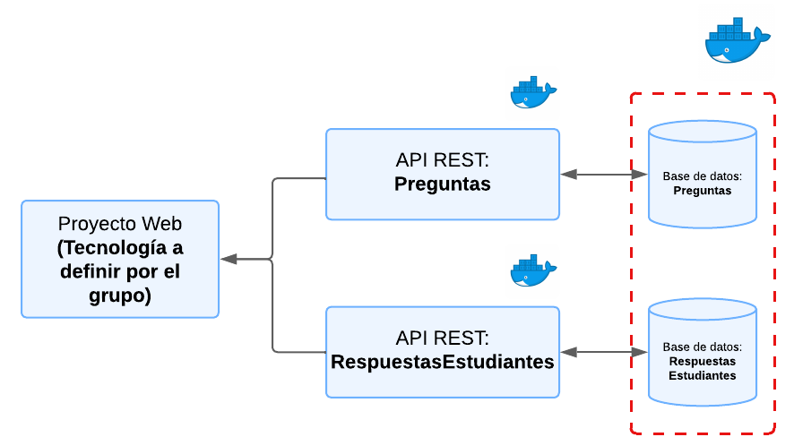
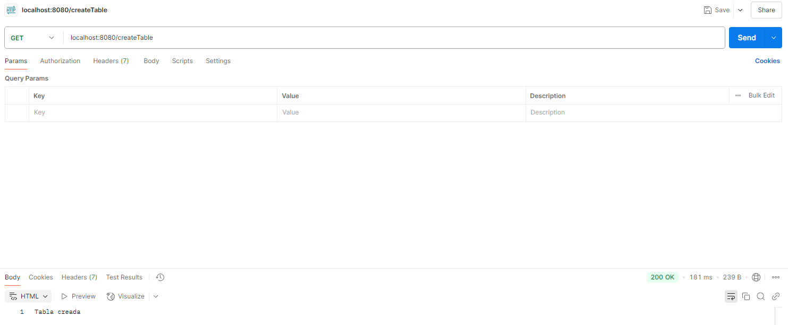
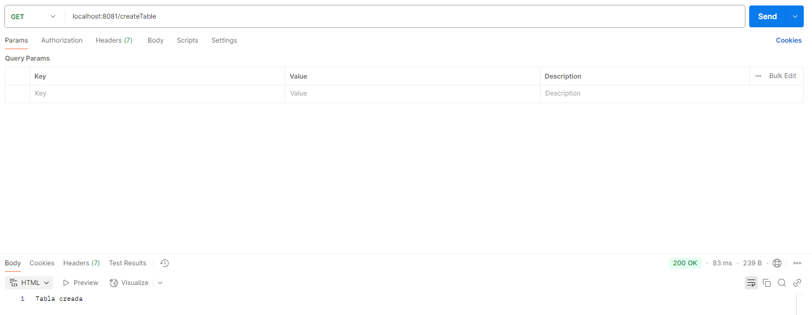

# GRUPO9-2025-PROYINF


Este es el repositorio del grupo 9, cuyos integrantes son:

* Benjamin Abde  - 202130021-k
* Joaquín Belmar - 202330003-9
* Nicolas Jego   - 202273013-7
* Alberto Oñate  - 202173103-2
* **Tutor**: Paula Castillo

## [Wiki](https://gitlab.com/benjax79/grupo9-2025-proyinf/-/wikis/home)

## Presentación cliente

[Video](https://youtu.be/s9JVPyjQAQs) de la **presentación del cliente**.

## Presentación prototipo

[Video](https://youtu.be/H5h_zy9Y0XM) de la presentación del **prototipo inicial**.


## Aspectos técnicos relevantes  

Si antes momento de montar el proyecto base, el usuario ha usado xampp anteriormente (o cualquier montura para sql/otros que use los puertos 3306), se debe parar ese servicio para montar las bases de datos usados en este proyecto.

## Requerimientos

Para utilizar el proyecto base debe tener instalado [Node.js](https://nodejs.org/en), [Docker](https://www.docker.com/), se recomienda usar Visual Studio Code para modificar cualquier archivo o para acceder a la consola, y se recomienda [Postman](https://www.postman.com/) para poder probar los endpoints de las APIs. Al ya tener instalado Docker, se recomienda reinciar el PC para un correcto funcionamiento.

## Puntos a Considerar
La solución a desarrollar debe seguir los siguientes lineamientos (imagen referecial al final):
* Se debe considerar dos API's:
    * **API_PREGUNTAS:** Con todo lo referido a las preguntas de los ensayos.
    * **API_RESPUESTASESTUDIANTES**: Con todo lo referido a las respuestas de los estudiantes a cada pregunta.
* Cada API contará con una base de datos mysql.
* Las API's deben ser construidas utilizando [Node.js](https://nodejs.org/en), además cuentan con [Express](https://expressjs.com/es/) para facilitar la construcción de estas.
* Las bases de datos deben estar en el mismo contenedor, pero no deben compartirse servicios.
* Cada servicio debe estar en un contenedor.
* El proyecto base solo considera los servicios.




## Levantando el proyecto
Iniciaremos levantando la imagen de mysql en docker.

1. Abra Docker Desktop.
2. Abra Visual Studio Code como administrador.
3. Abra en Visual Studio Code la carpeta **proyecto-base-main** de este repositorio.
4. Abra una terminal de bash directamente desde Visual Studio Code.
5. Ingrese en esa terminal, el siguiente código:
```
docker compose up --build
```
6. Luego de pasado unos segundos, abra Docker y verifique si el contenedor se ha cargado completamente.

Una vez ya realizado la configuración de sql en nuestro sistema, ya podemos crear las bases de datos.

### Configuración del Proyecto
#### Bases de Datos
Para comenzar, deben tener ejecutándose el contenedor de la base de datos sql.

Ahora, crearemos las bases de datos. Para esto debemos entrar en el contenedor, con el siguiente comando (Si el terminal de Visual Code Studio sigue funcionando, se puede crear otra terminal, o bien, ir a la consola de docker):
```
docker exec -it proyecto-base-main-mysql-1 mysql -uroot -p
```
En caso de haber problemas con el nombre de la base de datos, escribir en la terminal "docker ps" para verificiar el nombre del contenedor. Luego, deben ingresar la clave que en este caso es: **password**.

Una vez dentro del contenedor podemos crear las bases de datos:
```
create database BD09_PREGUNTAS;
```
Luego de estar la base de datos creada, se prosigue con la siguiente:
```
create database BD09_RESPUESTASESTUDIANTES;
```

### API's
#### API_PREGUNTAS
Con las bases de datos ya creadas, se deben consigurar sus respectivas API's. Para eso, se debe ir a la carpeta **API_PREGUNTAS** desde Visual Code Studio (o bien, escribir "cd API_PREGUNTAS" para ingresar desde la consola ya abierta).

Y se ingresa el siguiente comando:

```
docker compose up --build -d
```

#### API_RESPUESTASESTUDIANTES
Con las bases de datos ya creadas, se deben consigurar sus respectivas API's. Para eso, se debe ir a la carpeta **API_RESPUESTASESTUDIANTES** desde Visual Code Studio (o bien, escribir "cd API_RESPUESTASESTUDIANTES" para ingresar desde la consola ya abierta).

Y se ingresa el siguiente comando:

```
docker compose up --build -d
```

Una vez levantado todo, deberían poder ver en Docker todos sus contenedores corriendo:


Pueden probar los siguientes end-points en Postman para verificarlo:
```
GET: localhost:8080/createTable
```



```
GET: localhost:8081/createTable
```



Además, pueden poner en su navegador ```localhost:8080``` y/o ```localhost:8081```, y les debería salir el siguiente mensaje:


## Crear Tablas

Una vez ya creadas las bases de datos, hay que crear las tablas necesarias, que se encuentran en los archivos .sql, siguiendo las instruccciones a continuacion:

1. Abrir Visual Studio Code como administrador.
2. Dirigirse a la carpeta de nuestro proyecto "proyecto-base-main".
3. Abrir la terminal y copiar los archivos .sql al contenedor principal de docker, ingresando los siguientes comandos:

```
docker cp API_PREGUNTAS/archivos_sql/banca_preguntas.sql proyecto-base-main-mysql-1:/banca_preguntas.sql

docker cp API_RESPUESTASESTUDIANTES/archivos_sql/resultados_ensayos.sql proyecto-base-main-mysql-1:/resultados_ensayos.sql
```
4. Acceder a la terminal de docker con el siguiente comando:

```
docker exec -it proyecto-base-main-mysql-1 mysql -uroot -p
```
Seguido de esto, se debe ingresar la contraseña de la base de datos, osea "password".

5. Se ejecutan los archivos .sql copiados al contendor de docker para que se creen las tablas, con los siguientes comandos (todo desde la consola de docker):

```
source /banca_preguntas.sql;
source /resultados_ensayos.sql;
```
6. Para verificar la creacion de las tablas, desde la misma terminal de docker se puede ingresar los comandos:

```
USE BD09_PREGUNTAS;
SHOW TABLES;
```

Y para la base de datos de respuestas:

```
USE BD09_RESPUESTASESTUDIANTES;
SHOW TABLES;
```